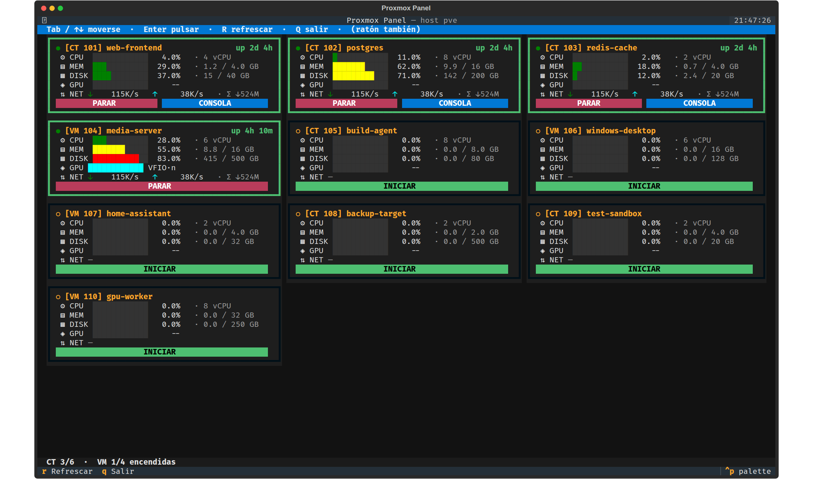
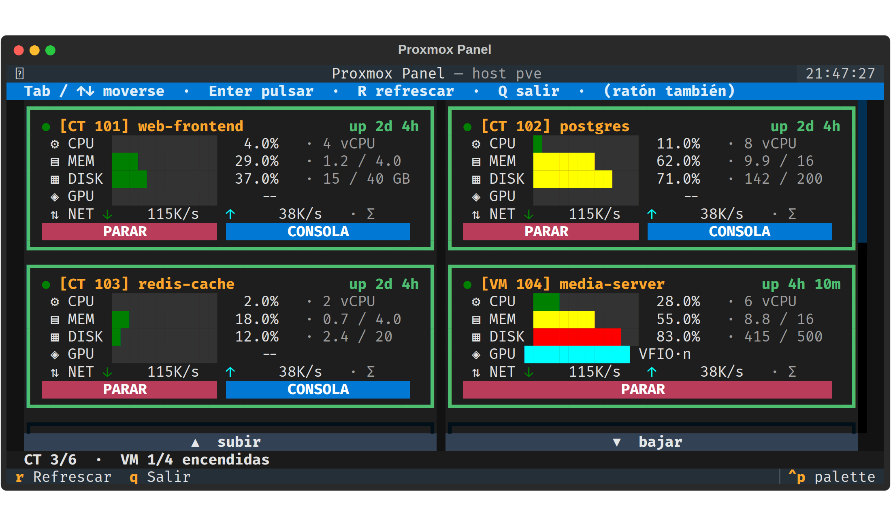
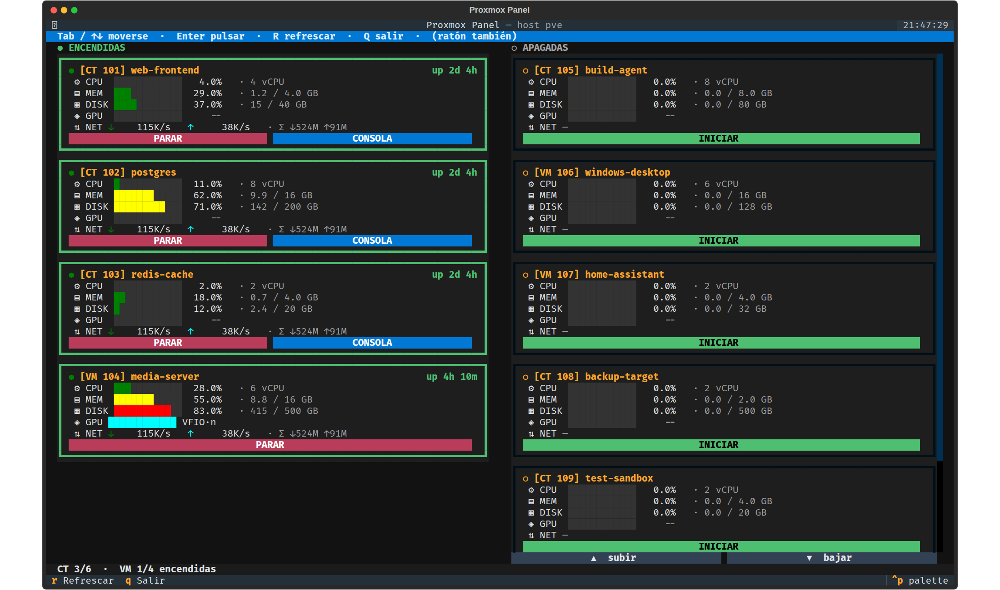
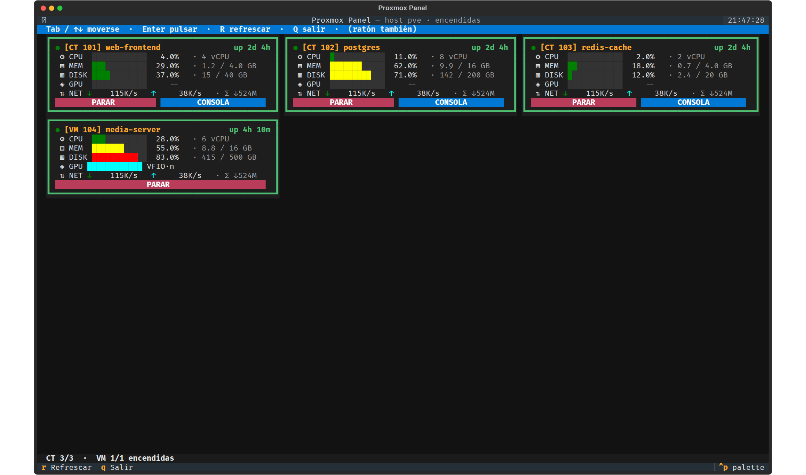

**English** | [Español](README.es.md)

# Proxmox TUI Panel

A full-screen terminal dashboard for Proxmox VE that lists every container and VM
with live CPU / memory / disk / GPU / network figures, and lets you start, stop or
open a console on each one. It runs **on the host itself** — no web browser, no
agent, no SSH tunnel — so it works on the machine's own monitor.



Built with [Textual](https://textual.textualize.io/). It reads everything from a
single `pvesh get /cluster/resources` call and acts through `pct` / `qm`.

## Why

The Proxmox web UI is excellent, but it needs another computer. This panel turns
the hypervisor's own screen into a status board: plug in a monitor and you can see
what is running and act on it, even when the network is down.

## Features

- **Mosaic layout** that adapts to the terminal: the number of columns is derived
  from the available width, and rows always keep a card's full height. When
  everything does not fit, the mosaic **scrolls** instead of squashing cards —
  cards never lose their button row.
- **Grouped by state**: running machines first, stopped ones after, sorted by
  VMID inside each group. Order is only recomputed when a machine actually
  changes state, so nothing flickers on the refresh tick.
- **Per-machine metrics**: `⚙ CPU` · `▤ MEM` · `▦ DISK` · `◈ GPU` · `⇅ NET`,
  with solid bars that turn yellow above 50 % and red above 80 %, plus absolute
  values (vCPUs, GB used/total, transfer rates and totals).
- **GPU passthrough aware**: VMs holding a GPU through VFIO are shown as `VFIO·<tag>`
  instead of a meaningless 0 %.
- **Actions**: start, stop and (for running containers) attach a console.
- **Split views**: `--mitades` splits the screen into two columns, running on
  the left and stopped on the right. `--filtro=vivas` / `--filtro=apagadas`
  restrict the panel to one group, if you would rather run two instances.
- Mouse and keyboard: `Tab` / arrows to move, `Enter` to press, `r` to refresh,
  `q` to quit. The mouse wheel scrolls a mosaic.
- **Touch-friendly scrolling**: when a mosaic overflows, a full-width
  `▲ subir` / `▼ bajar` bar appears under it. A terminal has no concept of a
  touch gesture — the app only ever receives keys and mouse events — so a swipe
  only reaches it if the terminal emulator translates it into wheel events, and
  Proxmox's web Shell does not while mouse tracking is on. A **tap**, however,
  does arrive as a click, so tapping is the way to scroll from a phone.

### Scrolling instead of clipping

On a short terminal the cards keep their full height and the mosaic scrolls:



### Split screen

`--mitades` puts running machines on the left and stopped ones on the right.
Each half uses a single wide column, so names and absolute values stay readable
and the overflow scrolls:



### One view per state



## Requirements

- Proxmox VE (tested on 8.x and 9.x) — `pvesh`, `pct` and `qm` on `PATH`
- Python 3.11+
- [Textual](https://pypi.org/project/textual/) 8.x
- Optional, for the physical monitor: [kmscon](https://github.com/Aetf/kmscon)
  with its `mod-pango.so` module, plus a monospaced font with good Unicode
  coverage (DejaVu Sans Mono works well)

## Install

```bash
git clone https://github.com/chemazener/proxmox-tui-panel.git
cd proxmox-tui-panel

install -d /opt/lxc-panel
install -m 644 app.py /opt/lxc-panel/app.py
install -m 755 panel /usr/local/bin/panel
python3 -m venv /opt/lxc-panel/venv
/opt/lxc-panel/venv/bin/pip install "textual==8.2.7"
```

On Debian you may need `apt install python3-venv` first — without it the virtual
environment is created without `pip` and the Textual install fails with a
confusing "No such file or directory".

Now run it:

```bash
panel                    # all machines
panel --mitades          # split: running | stopped
panel --filtro=vivas     # running only
panel --filtro=apagadas  # stopped only
```

`panel` is a three-line launcher; the systemd unit below does **not** create it,
so install it even if you only plan to use the service.

### On the host's monitor (optional)

```bash
install -d /etc/lxc-panel
install -m 644 lxc-panel.service /etc/systemd/system/
systemctl daemon-reload
systemctl enable --now lxc-panel.service
```

The unit wraps the panel in kmscon on `tty1`, which gives you a proper font and
mouse support on the console. It declares `Conflicts=getty@tty1.service`, so the
login prompt on tty1 is replaced by the panel.

kmscon is not packaged in Debian; the [Aetf fork](https://github.com/Aetf/kmscon)
works well. Three things are easy to miss when installing it by hand: the
`kmscon` in `PATH` is a wrapper script that execs the real binary from
`libexec`, it needs `libtsm`, and it needs its **`mod-pango.so`** module (see the
gotchas below).

### Starting it on login (optional)

To get the panel on every interactive root login as well, append
[`profile-autostart.sh`](profile-autostart.sh) to `/root/.profile`. It is guarded
so `ssh host "cmd"`, `scp` and `rsync` are unaffected — check that yourself after
installing, because silently breaking them is unpleasant to debug:

```bash
time ssh root@your-host 'echo ok'    # must return immediately
```

## Configuration

Everything host-specific lives in `/etc/lxc-panel/config.json`, which is **not**
part of this repository. Without it the panel still works — it just cannot label
GPU passthrough. Copy `config.example.json` and adjust:

| Key | Meaning |
|---|---|
| `gpu_passthrough_pci` | `{"<pci-prefix>": "<label>"}`. Any VM whose config has a `hostpci` line matching a prefix is shown as `VFIO·<first letter of label>`. Get the prefixes from `lspci`. |
| `subtitulo` | Text next to the title. Empty means use the hostname. |

```bash
install -m 600 config.example.json /etc/lxc-panel/config.json
```

## Notes and gotchas

- **`--font-size` is ignored and the icons show as boxes.** kmscon fell back to
  its built-in `8x16` bitmap font because `mod-pango.so` could not be loaded.
  Check `journalctl -u lxc-panel | grep "font engine"`; it must say `[pango]`.
  The module is `dlopen`ed, so `ldd` on the kmscon binary will not reveal the
  missing dependency.
- **Do not measure the terminal size on `/dev/tty1`.** Cell metrics come from the
  font, so a smaller `--font-size` means more columns — but `TIOCGWINSZ` on
  `/dev/tty1` reports the *kernel console* geometry, which never changes when you
  restyle kmscon. It cost me a while to notice. Measure the pty the panel is
  actually rendering into:

  ```bash
  PID=$(ps -eo pid,tty,cmd | awk '/app\.py/ && $2 ~ /pts/ {print $1; exit}')
  TTY=$(ps -o tty= -p "$PID" | tr -d ' ')
  python3 -c "import fcntl,struct,sys,termios
  f=open('/dev/$TTY','rb')
  print(struct.unpack('HHHH', fcntl.ioctl(f, termios.TIOCGWINSZ, b'\0'*8))[:2])"
  ```
- **Colour emoji do not render** on the console. DejaVu Sans Mono has no emoji
  glyphs, so the panel deliberately sticks to monochrome symbols. Verify a
  candidate glyph with
  `fc-query -f "%{charset}" /usr/share/fonts/truetype/dejavu/DejaVuSansMono.ttf`.
- **Two monitors cannot show different views under kmscon.** A seat owns a whole
  DRM device, not individual connectors, so two outputs on the same GPU get
  mirrored. Splitting views across physical screens needs a compositor (sway and
  similar) that can place a window per output — and it would still go dark when
  that GPU is passed through to a VM. `--mitades` is the cheap way out: it splits
  the one screen you have, and both mirrored monitors show the same split.
- **The panel cannot run while the GPU driving the console is passed through** to
  a VM: the DRM master conflict blanks the screen.
- Consoles are opened with `lxc-console`, not `pct console`. The latter wraps the
  session in a persistent `dtach` that does not close by itself and leaves the
  panel hanging.

## Previewing changes without touching the monitor

Textual can render the app headless, which is handy for reviewing layout changes:

```python
import asyncio, sys
sys.path.insert(0, "/opt/lxc-panel")
import app as A

A.list_machines = lambda: [...]          # sample data, no live host needed

async def shot():
    app = A.LXCPanel()
    async with app.run_test(size=(160, 50)) as pilot:
        await pilot.pause()
        open("out.svg", "w").write(app.export_screenshot())

asyncio.run(shot())
```

The SVG can be turned into a PNG with any browser:
`chromium --headless --screenshot=out.png --window-size=2200,1300 out.svg`.

## License

MIT — see [LICENSE](LICENSE).
